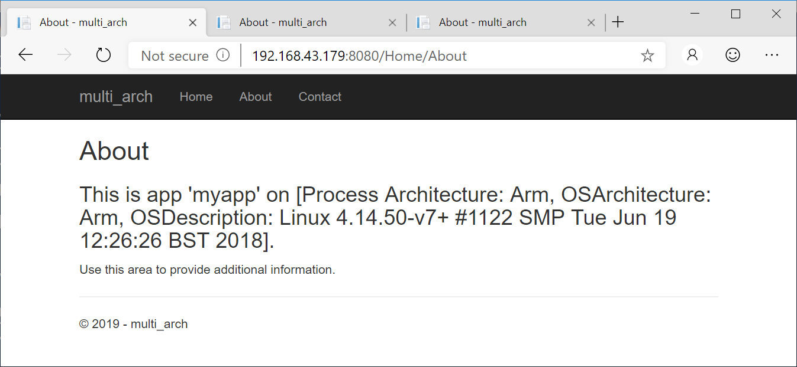
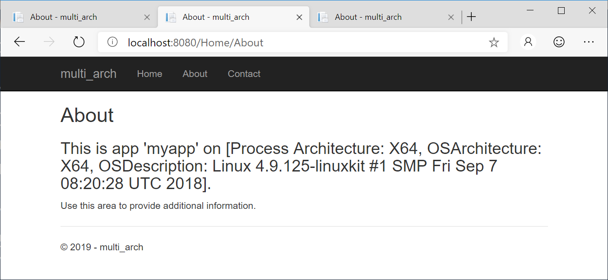
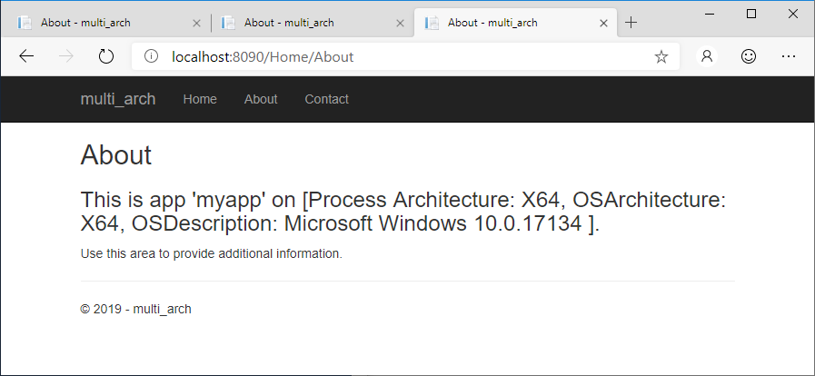

# Multi Arch Container Images with .NET Core and Azure Pipelines (yaml)

This is a very basic example of how to utilize Docker, .NET Core and Azure Pipelines to create a container image that will work under different architectures, but with the same name and providing the same functionality.

The sample application here was created by simply using the ASP.NET Core (version 2.1) bootstrapping method ```dotnet new mvc``` with only one change applied afterwards to display some information about the OS and Architecture the app is currently in.

## Features

* Three architectures:
   * ARM
   * Linux x64
   * Windows x64
* Two Dockerfiles
   * [Dockerfile.Windows](./Dockerfile.Windows)
   * [Dockerfile.Linux](./DockerFile.Linux) 
* YAML-Build Pipeline
   * [YAML based build pipeline](./azure-pipelines.yml)
   * [Step Template for building and pushing](./yml-steps/build-and-push.yml)
   * [Step Template for creating the manifest list](./yml-steps/create-manifest-list.yml)
* Creates and pushes three separate and appropriately tagged images for the three architectures.
* All single images are tagged with the build id (to be able to distinctively use specific versions in environments).
* Overarching manifest list is pushed without arch tag (obviously) and build id.
* Only the manifest list additionally gets a latest tag.

## Result

The resulting image supports being run on Windows, Linux or ARM all using the same name, e.g.:

```sh
docker container run -d -p 8080:80 myregistry.azurecr.io/myapp:latest
```

The following screenshots were taken from running the sample on a Rasperry Pi (ARM) and Docker Desktop for Windows 10 (Linux x64 and Windows x64).



----------



----------



## Setup

### Prerequisites:

* An Azure DevOps organization and project (can be [created for free](https://docs.microsoft.com/en-us/azure/devops/pipelines/get-started/pipelines-sign-up?view=azure-devops)).
* A Docker registry, to which you have credentials, e.g. an Azure Container Registry (which can be easily created as well, see [here](https://docs.microsoft.com/en-us/azure/container-registry/container-registry-get-started-azure-cli)). For ACR, you need to make sure that the [Admin account is enabled](https://docs.microsoft.com/en-us/azure/container-registry/container-registry-authentication#admin-account) and you have the credentials ready.

### Steps

1. Create a pipeline in Azure Pipelines using this repository with its [azure-pipelines.yml](./azure-pipelines.yml). You can either import this repository to your Azure DevOps project or reference this repository directly from the pipeline (though then you cannot change it). See the [docs](https://docs.microsoft.com/en-us/azure/devops/pipelines/get-started/pipelines-get-started?view=azure-devops&tabs=yaml) for more info.
1. Add three variables as described in the [docs](https://docs.microsoft.com/en-us/azure/devops/pipelines/process/variables?view=azure-devops&tabs=yaml%2Cbatch#secret-variables) for setting secrets for an Azure pipeline:
    * REGISTRYURL - containing only the host name of your registry (e.g. ```myregistry.azurecr.io```, without protocol, i.e. not ```https://myregistry.azurecr.io```)
    * REGISTRY_USERNAME - your registry user.
    * REGISTRY_PASSWORD - your registry password.

    Make sure that you **only set the password as a secret** - the other two variables will not be propagated to the buid steps otherwise.

> Note that for production use it is recommended to change the authentication method to something more secure, e.g. by using a [managed identity](https://docs.microsoft.com/en-us/azure/container-registry/container-registry-authentication-managed-identity). 

## Resources

* https://docs.microsoft.com/en-us/azure/container-registry/
* https://docs.microsoft.com/en-us/azure/devops/pipelines
* https://docs.microsoft.com/en-us/azure/devops/pipelines/process/templates?view=azure-devops
* https://medium.com/@mauridb/docker-multi-architecture-images-365a44c26be6